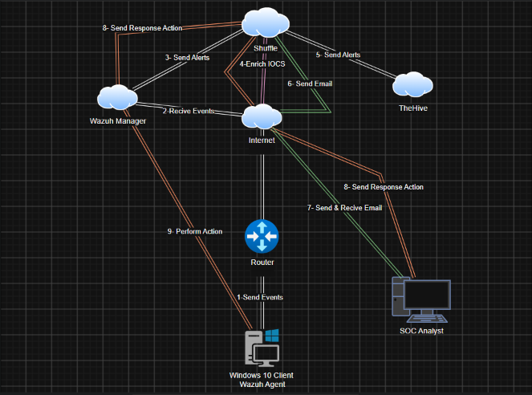

# SOC-Automation-Projects
In this project, we are desinging, installing, configuring, and generating actual events on the end point. This project is a starting point for SOC Analysts and other SOC positions. 
This repostiory will be updated whenever a new project idea is presented, starting with the home lab creation to invistigating and analyzing threats and malware similar to what a real SOC Analyst experiences in day to day basis. 

# 1- DESIGN 
This phase will showcase the architecture that the project will follow, the importantce here is to clearly visualize the data flow and interactions between different components. 
This diagram is created using **draw.io** with the following components:
1. Window 10 Client Wazuh Agent - responsible for sending events
2. Router - routing traffic between nodes
3. Internet - Main point of traffic
4. Wazuh Manager - Sending alerts to Shuffle & performing Responsive actions
5. Shuffle - Sending alerts to TheHive & Sending emails
6. TheHive - Recives alerts from Shuffle

Each link with a different color represents a different process, this being: 
 
1.**White** : The first link in *step 1* connecting Wazuh Agent to the Internet to send events, in which the Internet then sends to Wazuh manager in *step 2*, followed by Wazuh manager sending an alert to Shuffle in *step 3*, and finally in *step 5* where Shuffle sends alerts to TheHive. 
 
2.**Green** : This link focuses on the interaction of sending and reciving emails from Shuffle to the SOC Analyst, shown in *steps 6 and 7*. 
 
3.**Orange** : This link is concerned with the sending responsive actions and performing said actions, as shown in *steps 8 and 9*. 
 
4.**Pink** : The shortest link, yet one of the most important. This link is responsible for the enrichment of IOCS needed for the responsive actions later on. Shown in *step 4*. 
 
 

